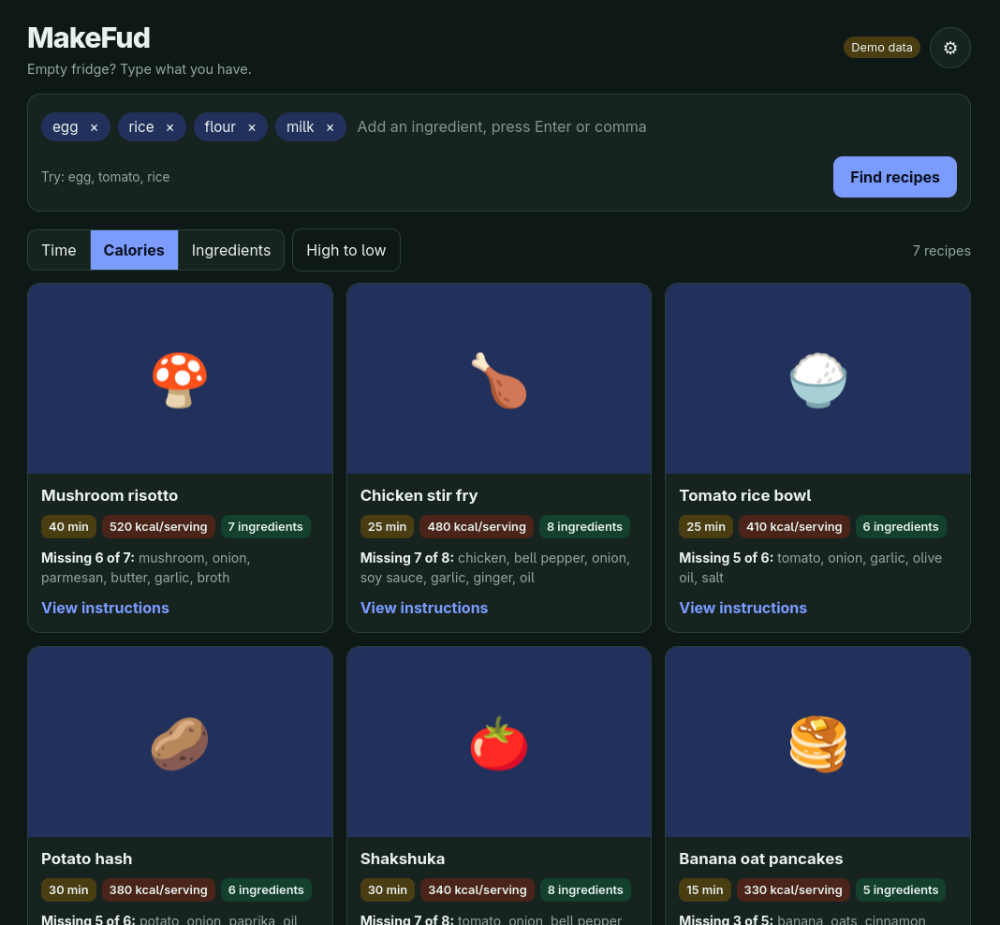

# MakeFud 🍳

> Empty fridge? Type what you have. Get recipes sorted by prep time, calories, or ingredient count.

MakeFud is a zero-build, ultra-lean web application that turns whatever ingredients you have left in your pantry or fridge into healthy, realistic meals[cite: 1, 3]. It minimizes food waste and takes the stress out of cooking on a budget or with limited time.

---

## Preview



---

## Features

- **Fridge-to-Plate Matching:** Enter whatever raw ingredients you have on hand to find recipes that maximize what you already own[cite: 3].
- **Missing Ingredients Breakdown:** In-browser fuzzy matching shows exactly which extra items a recipe needs[cite: 3].
- **Zero-Cost Sorting:** Instant client-side sorting by preparation time, calories per serving, or total ingredient count[cite: 3].
- **Offline / Demo Mode:** Ships with built-in mock recipes so you can run and test the app immediately without an API key or internet connection.
- **Zero-Build Architecture:** Pure HTML, native CSS, and vanilla ES6+. No `npm`, bundlers, compilers, or heavy frameworks.
- **Responsive & Accessible:** Dark and light theme support based on system settings, safe-area viewport handling, and full keyboard navigation[cite: 1, 3].
- **Privacy First:** API keys are stored locally in your browser's `localStorage` and sent strictly to the upstream provider[cite: 3].

---

## Quick Start
### 1. Run Locally

Because there is no build step, you can run the app directly:

```bash
# Clone the repository
git clone https://github.com/tahaenasraoui-debug/makefud-app.git
cd makefud-app

# Serve using Python (or any static HTTP server)
python3 -m http.server 8000 --bind 127.0.0.1
```

Then open http://localhost:8000 in your browser. Demo mode is on by default, so no API key is needed.
